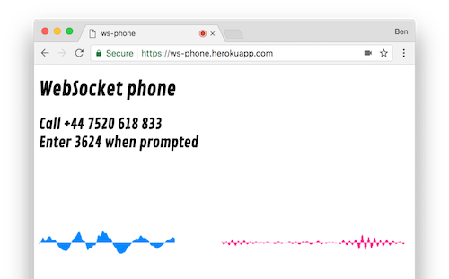

# ws-phone

Receive voice calls in your browser.



_note: this requires [getUserMedia/Stream API](http://caniuse.com/#feat=stream) (ie. Not Safari)_

## Development/Deployment

### Requirements

* [node](https://nodejs.org/en/) & [yarn](https://yarnpkg.com)
* a publicly available host to run your application (heroku works pretty well)
* a Nexmo number and associated app with the following endpoints:
  * `answer`: https://YOUR_URL/answer
  * `event`: https://YOUR_URL/event

### Running

```bash
# Install dependencies (npm would work too)
yarn install

# The number to be displayed on the page
export INBOUND_NUMBER='+44 7575 123 456'
node app.js
```

Visit `http://your-url:3000` to see your app.

## How this works

This makes use of a Nexmo feature of connecting a voice call to a [WebSocket endpoint](https://docs.nexmo.com/voice/voice-api/websockets).  The node server listens out for incoming websocket connections and proxies them on to the relevant browser session.

Messages contain raw audio data at 16k split into 0.2s chunks.

Within the browser, incoming messages are transformed by assigning the raw data to an AudioBufferSourceNode with the appropriate sample rate (16k). The browser takes care of resampling this to 44k.

Microphone audio is read by feeding it into a ScriptProcessorNode - where the raw audio can be manually downsampled and emitted on the websocket every 320 samples (0.2s).
